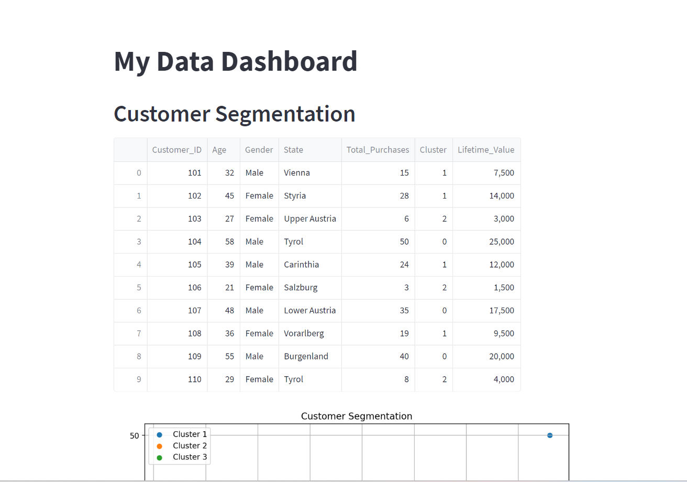

# AI Powered Demand Forecasting for an B2C Solar Energy Company
AI Powered Demand Forecasting for an B2C Solar Energy Company. 
The scripts you've provided use a combination of machine learning (a subset of artificial intelligence) and data analysis techniques to perform various tasks related to business analytics and forecasting. 

## Environment Setup:
Make sure you have Python installed on your system. You can download it from the official Python website. 
The scripts provided here are compatible with Python 3.

### Install Required Libraries:
Open your terminal and install the required libraries using pip (Python's package installer). The main libraries you'll need are pandas, sklearn, matplotlib, and streamlit. 
You can install them with the following command: `pip install pandas sklearn matplotlib streamlit`

### Save the Scripts and Data:
Save the Python scripts (customer_segmentation.py, sales_prediction.py, inventory_management.py, and energy_generation_planning.py) and the associated data files in the same directory on your system.

### Run the Streamlit App:
Navigate to the directory containing the scripts and data files in your terminal. Then, run the Streamlit app using the following command:
`streamlit run app.py`

This command tells Streamlit to run the app.py script, which in turn executes the other scripts and displays the results in the Streamlit dashboard.

## Access the Dashboard:
After running the command, Streamlit will provide a local URL (usually http://localhost:8501) in the terminal. Open this URL in your web browser to view the dashboard.

## Explaination
### Inventory Management:
This script loads inventory data and checks if the demand meets the reorder point to trigger a reorder. 
It also plots the inventory levels over time, which can be used to visually monitor inventory status and identify any potential issues. 
The inventory data, reorder dates, and the inventory plot are displayed under the "Inventory Management" section of the dashboard.

### Sales and Revenue Prediction:
This script loads sales data, preprocesses it, and applies a linear regression model to predict future sales for the next 12 weeks. 
This information can help the company plan for future demand and manage resources effectively. 
The predicted sales and sold quantities for the next 12 weeks are displayed under the "Sales & Revenue Prediction" section of the dashboard.

### Customer Segmentation:
This script performs customer segmentation using k-means clustering based on customers' ages and total purchases. 
The result is a scatter plot showing the different clusters of customers. This information can be used to understand different customer profiles and target marketing efforts more effectively. 
The results of this segmentation and the associated plot are displayed under the "Customer Segmentation" section of the dashboard.

### Energy Generation Planning and Predictive Maintenance (for solar installations):
This script loads sensor data from solar installations, checks for potential equipment failures, and calculates average solar production and energy consumption. 
It also plots solar production and energy consumption over time, which can be used to plan for energy generation and consumption. 
The average solar production, average energy consumption, and the energy plots are displayed under the "Energy Generation Planning" section of the dashboard.
